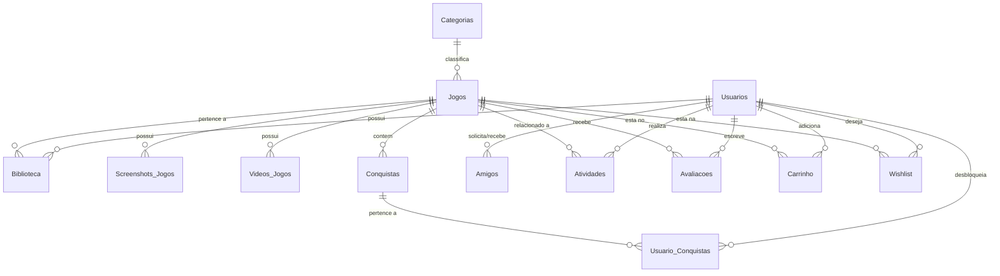

# Relatório de Projeto Interdisciplinar
## Banco de Dados & Programação Web II

**Curso:** Tecnologia em Análise e Desenvolvimento de Sistemas  
**Instituição:** Instituto Federal do Sul de Minas Gerais — Campus Poços de Caldas  
**Integrantes:** Aluno 1, Aluno 2, Aluno 3, Aluno 4 *(Preencha com os nomes do grupo)*  
**Semestre/Ano:** 1º Semestre / 2026  

---

## 1. Visão Geral do Projeto
O presente projeto consiste no desenvolvimento do **Aether**, uma plataforma web de catálogo, compra e simulação de tempo de jogo de jogos digitais, inspirada em plataformas reais como a Steam. O objetivo é demonstrar a integração entre a modelagem de dados relacionais e o desenvolvimento de aplicações web completas, integrando o backend estruturado e persistência de dados em tempo real.

---

## 2. Parte I — Banco de Dados

### 2.1 Descrição do Modelo
O sistema modelado é uma **loja de jogos digitais** (Game Store), onde as principais entidades representam a jornada do usuário desde o cadastro até a aquisição de jogos e interação social.

* **Principais Atores e Entidades:**
  * **Usuário (`Usuarios`):** Atores que possuem perfil, carteira com saldo financeiro, biblioteca de jogos e lista de amigos.
  * **Jogo (`Jogos`):** Itens principais do catálogo, categorizados, contendo mídia (fotos/vídeos) e conquistas associadas.
  * **Categoria (`Categorias`):** Gêneros associados aos jogos para catalogação e filtragem.
  * **Biblioteca (`Biblioteca`):** Entidade associativa que vincula os usuários aos jogos adquiridos, registrando também o tempo de jogo (horas jogadas).
  * **Conquistas (`Conquistas` e `Usuario_Conquistas`):** Desafios dentro dos jogos que podem ser desbloqueados pelos usuários.
  * **Interações Sociais (`Amigos`, `Avaliacoes`, `Atividades`):** Permitem amizades entre usuários, avaliações com nota/comentário para jogos e um feed de atividade pública.
  * **Carrinho e Lista de Desejos (`Carrinho`, `Wishlist`):** Controle de compras e intenção de aquisição futuras.

* **Restrições de Negócio:**
  * Um usuário não pode comprar o mesmo jogo duas vezes (restrição de PK em `Biblioteca`).
  * O saldo da carteira deve ser suficiente para realizar a compra.
  * Avaliações são únicas por par Usuário-Jogo.
  * Relacionamentos de amizade são únicos entre dois usuários.

### 2.2 Modelo Entidade-Relacionamento (MER)
O diagrama conceitual do banco de dados encontra-se representado na imagem [diagrama.jpg](file:///C:/Users/renan/programs/db-web2-project/diagrama.jpg) localizada na raiz do projeto. 

Abaixo, apresenta-se uma visualização lógica estrutural dos relacionamentos através de um diagrama simplificado:



### 2.3 Modelo Relacional
Representação lógica do esquema com indicação de Chaves Primárias `[PK]` e Chaves Estrangeiras `[FK]`, acompanhada de três tuplas de exemplo para comprovação das cardinalidades.

1. **Usuarios** (`id_usuario` [PK], `nome`, `email`, `senha`, `avatar_url`, `saldo_carteira`, `data_cadastro`)
   * *(1, 'Alice', 'alice@example.com', 'senha', 'https://api.dicebear.com/7.x/pixel-art/svg?seed=Alice', 500.00, '2026-01-01 10:00:00')*
   * *(2, 'Bob', 'bob@example.com', 'senha', 'https://api.dicebear.com/7.x/pixel-art/svg?seed=Bob', 250.50, '2026-02-15 14:30:00')*
   * *(3, 'Charlie', 'charlie@example.com', 'senha', 'https://api.dicebear.com/7.x/pixel-art/svg?seed=Charlie', 20.00, '2026-03-20 18:45:00')*

2. **Categorias** (`id_categoria` [PK], `nome_categoria`, `descricao`)
   * *(1, 'Ação', 'Jogos de combate rápido, tiro e adrenalina.')*
   * *(2, 'RPG', 'Role-playing games com histórias profundas e progressão.')*
   * *(3, 'Corrida', 'Simuladores de corrida e direção em alta velocidade.')*

3. **Jogos** (`id_jogo` [PK], `titulo`, `descricao`, `preco`, `data_lancamento`, `desenvolvedor`, `distribuidora`, `capa_url`, `banner_url`, `id_categoria` [FK -> Categorias])
   * *(1, 'Counter-Strike 2', 'Tiro tático de precisão...', 0.00, '2023-09-27', 'Valve', 'Valve', '...', '...', 1)*
   * *(2, 'Cyberpunk 2077', 'RPG de ação futurista...', 199.90, '2020-12-10', 'CD PROJEKT RED', 'CD PROJEKT RED', '...', '...', 2)*
   * *(3, 'Forza Horizon 5', 'Corrida em mundo aberto...', 249.00, '2021-11-09', 'Playground Games', 'Xbox Game Studios', '...', '...', 3)*

4. **Biblioteca** (`id_usuario` [PK][FK -> Usuarios], `id_jogo` [PK][FK -> Jogos], `data_aquisicao`, `horas_jogadas`)
   * *(1, 1, '2026-01-05 18:20:00', 124.50)*
   * *(1, 2, '2026-03-10 12:00:00', 45.20)*
   * *(2, 1, '2026-02-16 19:00:00', 12.00)*

5. **Conquistas** (`id_conquista` [PK], `id_jogo` [FK -> Jogos], `nome_conquista`, `descricao`, `pontos`, `icone_url`, `data_criacao`)
   * *(1, 1, 'Primeiro Sangue', 'Consiga a primeira eliminação.', 10, '...', '2026-01-05 10:00:00')*
   * *(2, 1, 'Mestre das Armas', 'Vença no modo Corrida de Armas.', 15, '...', '2026-01-05 10:00:00')*
   * *(3, 2, 'Caminho do Samurai', 'Conclua a história principal.', 40, '...', '2026-01-05 10:00:00')*

6. **Usuario_Conquistas** (`id_usuario` [PK][FK -> Usuarios], `id_conquista` [PK][FK -> Conquistas], `data_desbloqueio`)
   * *(1, 1, '2026-01-05 20:15:00')*
   * *(1, 2, '2026-01-10 15:40:00')*
   * *(2, 1, '2026-02-17 11:20:00')*

7. **Amigos** (`id_amizade` [PK], `id_usuario` [FK -> Usuarios], `id_amigo` [FK -> Usuarios], `status_amizade`, `data_solicitacao`, `data_aceite`)
   * *(1, 1, 2, 'aceita', '2026-01-10 12:00:00', '2026-01-10 12:30:00')*
   * *(2, 1, 3, 'pendente', '2026-06-20 15:00:00', NULL)*
   * *(3, 2, 3, 'aceita', '2026-03-01 10:00:00', '2026-03-02 11:00:00')*

8. **Atividades** (`id_atividade` [PK], `id_usuario` [FK -> Usuarios], `id_jogo` [FK -> Jogos], `tipo_atividade`, `descricao`, `visibilidade`, `data_hora`)
   * *(1, 1, 1, 'comprou', 'Alice comprou Counter-Strike 2', 'publica', '2026-01-05 18:20:00')*
   * *(2, 1, 1, 'conquista', 'Alice desbloqueou a conquista Primeiro Sangue em Counter-Strike 2', 'publica', '2026-01-05 20:15:00')*
   * *(3, 2, 1, 'jogou', 'Bob jogou Counter-Strike 2 por mais 3.0 horas.', 'amigos', '2026-02-18 17:30:00')*

9. **Avaliacoes** (`id_avaliacao` [PK], `id_usuario` [FK -> Usuarios], `id_jogo` [FK -> Jogos], `nota`, `comentario`, `recomendaria`, `data_avaliacao`)
   * *(1, 1, 2, 10, 'Jogo fenomenal! Exploração incrível.', 1, '2026-03-20 15:30:00')*
   * *(2, 2, 1, 9, 'Tiro tático muito bom.', 1, '2026-04-10 18:20:00')*
   * *(3, 1, 1, 8, 'Excelente jogabilidade clássica.', 1, '2026-01-10 14:00:00')*

10. **Carrinho** (`id_usuario` [PK][FK -> Usuarios], `id_jogo` [PK][FK -> Jogos], `data_adicao`)
    * *(1, 3, '2026-06-24 12:00:00')*
    * *(2, 2, '2026-06-24 13:00:00')*
    * *(3, 1, '2026-06-24 14:00:00')*

11. **Wishlist** (`id_usuario` [PK][FK -> Usuarios], `id_jogo` [PK][FK -> Jogos], `data_adicao`)
    * *(1, 3, '2026-02-01 14:00:00')*
    * *(2, 2, '2026-03-01 09:00:00')*
    * *(3, 2, '2026-04-15 11:30:00')*

12. **Screenshots_Jogos** (`id_screenshot` [PK], `id_jogo` [FK -> Jogos], `imagem_url`, `ordem`)
    * *(1, 1, 'https://cdn.akamai.steamstatic.com/...', 1)*
    * *(2, 1, 'https://cdn.akamai.steamstatic.com/...', 2)*
    * *(3, 2, 'https://cdn.akamai.steamstatic.com/...', 1)*

13. **Videos_Jogos** (`id_video` [PK], `id_jogo` [FK -> Jogos], `video_url`)
    * *(1, 1, 'https://video.akamai.steamstatic.com/...', 1)*
    * *(2, 2, 'https://video.akamai.steamstatic.com/...', 1)*
    * *(3, 3, 'https://video.akamai.steamstatic.com/...', 1)*

### 2.4 Normalização
O esquema do banco de dados do projeto **Aether** foi projetado diretamente na **3ª Forma Normal (3FN)**.

* **Justificativa de Conformidade:**
  * **1ª Forma Normal (1FN):** Todos os atributos contêm apenas valores atômicos e indivisíveis. Não existem grupos repetitivos ou atributos multivalorados (por exemplo, múltiplos caminhos de imagem de captura de tela são armazenados como registros individuais em uma tabela separada `Screenshots_Jogos`, em vez de uma lista delimitada).
  * **2ª Forma Normal (2FN):** O esquema está na 1FN e todas as colunas que não são chaves primárias são totalmente dependentes da chave primária inteira, não havendo dependências parciais. Em tabelas com chaves compostas (como `Biblioteca` e `Usuario_Conquistas`), atributos não-chave como `horas_jogadas` e `data_desbloqueio` dependem obrigatoriamente de ambos os componentes da chave primária composta (Usuário + Jogo ou Usuário + Conquista).
  * **3ª Forma Normal (3FN):** O esquema está na 2FN e nenhuma coluna que não seja chave primária depende de outra coluna que também não seja chave primária (ausência de dependência transitiva). Todos os campos dependem direta e exclusivamente da chave identificadora da tabela. Por exemplo, em `Jogos`, as informações de categoria não-chave estão associadas apenas ao `id_categoria`, que é chave primária na sua própria tabela `Categorias`, eliminando duplicações desnecessárias.

### 2.5 Dependências Funcionais
As dependências funcionais de cada tabela do modelo relacional final são mapeadas no formato $A \rightarrow B$ (onde $A$ determina funcionalmente $B$):

* **Tabela Usuarios:**
  * `id_usuario` $\rightarrow$ `nome`, `email`, `senha`, `avatar_url`, `saldo_carteira`, `data_cadastro` (Dependência Total)
  * `email` $\rightarrow$ `id_usuario`, `nome`, `senha`, `avatar_url`, `saldo_carteira`, `data_cadastro` (Chave candidata)
* **Tabela Categorias:**
  * `id_categoria` $\rightarrow$ `nome_categoria`, `descricao` (Dependência Total)
* **Tabela Jogos:**
  * `id_jogo` $\rightarrow$ `titulo`, `descricao`, `preco`, `data_lancamento`, `desenvolvedor`, `distribuidora`, `capa_url`, `banner_url`, `id_categoria` (Dependência Total)
* **Tabela Biblioteca:**
  * `(id_usuario, id_jogo)` $\rightarrow$ `data_aquisicao`, `horas_jogadas` (Dependência Total sobre chave composta)
* **Tabela Conquistas:**
  * `id_conquista` $\rightarrow$ `id_jogo`, `nome_conquista`, `descricao`, `pontos`, `icone_url`, `data_criacao` (Dependência Total)
* **Tabela Usuario_Conquistas:**
  * `(id_usuario, id_conquista)` $\rightarrow$ `data_desbloqueio` (Dependência Total sobre chave composta)
* **Tabela Amigos:**
  * `id_amizade` $\rightarrow$ `id_usuario`, `id_amigo`, `status_amizade`, `data_solicitacao`, `data_aceite` (Dependência Total)
  * `(id_usuario, id_amigo)` $\rightarrow$ `id_amizade`, `status_amizade`, `data_solicitacao`, `data_aceite` (Chave candidata composta única)
* **Tabela Atividades:**
  * `id_atividade` $\rightarrow$ `id_usuario`, `id_jogo`, `tipo_atividade`, `descricao`, `visibilidade`, `data_hora` (Dependência Total)
* **Tabela Avaliacoes:**
  * `id_avaliacao` $\rightarrow$ `id_usuario`, `id_jogo`, `nota`, `comentario`, `recomendaria`, `data_avaliacao` (Dependência Total)
  * `(id_usuario, id_jogo)` $\rightarrow$ `id_avaliacao`, `nota`, `comentario`, `recomendaria`, `data_avaliacao` (Chave candidata composta única)

---

## 3. Parte II — Implementação SQL

### 3.1 Criação das Tabelas (DDL)
A criação das tabelas e a definição das restrições de integridade referencial estão presentes no arquivo [create-database.sql](file:///C:/Users/renan/programs/db-web2-project/database/create-database.sql).
* **Especificações Técnicas:**
  * Utilização de tipos de dados modernos e otimizados (`INT`, `VARCHAR`, `DECIMAL(10,2)` para valores monetários, `DATETIME`, `TEXT`, `ENUM`).
  * Definição de chaves primárias (`PRIMARY KEY`) e estrangeiras (`FOREIGN KEY`).
  * Clausulas de integridade referencial ativa: `ON DELETE CASCADE` e `ON UPDATE CASCADE` (e `ON DELETE RESTRICT` onde aplicável para garantir consistência).
  * Clausulas `DROP TABLE IF EXISTS` ordenadas de forma a respeitar as chaves estrangeiras, permitindo a fácil reexecução do script.

### 3.2 Inserção de Dados (DML)
A inserção dos dados de teste é realizada através do script JavaScript [seed.js](file:///C:/Users/renan/programs/db-web2-project/database/seed.js).
* **Características:**
  * População de pelo menos 50 jogos usando dados reais indexados de títulos populares da Steam.
  * Inserção de múltiplos usuários de testes com saldos e estados variados.
  * População completa de todas as tabelas associativas e de relacionamento social (`Amigos`, `Biblioteca`, `Usuario_Conquistas`, `Avaliacoes`, `Wishlist`).

### 3.3 Consultas SQL
Abaixo estão detalhadas 4 consultas SQL projetadas para a plataforma, atendendo aos requisitos mínimos de JOIN e cruzamento de 3 ou mais tabelas.

#### Consulta 1: Relatório de Jogos em Destaque (Cruzamento de 3 Tabelas e Agregação)
* **Objetivo:** Listar os jogos mais populares com base na avaliação média, exibindo a categoria de cada jogo e a quantidade de reviews recebidas.
* **Código SQL:**
```sql
SELECT 
    j.id_jogo, 
    j.titulo, 
    j.preco, 
    c.nome_categoria,
    COALESCE(r.nota_media, 0) AS nota_media,
    COALESCE(r.total_avaliacoes, 0) AS total_avaliacoes
FROM Jogos j
-- Cruza com a tabela Categorias
INNER JOIN Categorias c ON c.id_categoria = j.id_categoria
-- Subconsulta agregada para calcular médias e contagem de Avaliações
LEFT JOIN (
    SELECT 
        id_jogo, 
        ROUND(AVG(nota), 1) AS nota_media, 
        COUNT(*) AS total_avaliacoes
    FROM Avaliacoes
    GROUP BY id_jogo
) r ON r.id_jogo = j.id_jogo
ORDER BY nota_media DESC, total_avaliacoes DESC
LIMIT 4;
```
* **Resultado Esperado:**
| id_jogo | titulo | preco | nome_categoria | nota_media | total_avaliacoes |
| :--- | :--- | :--- | :--- | :--- | :--- |
| 11 | Elden Ring | 229.90 | RPG | 10.0 | 1 |
| 21 | Forza Horizon 5 | 249.00 | Corrida | 9.0 | 1 |

#### Consulta 2: Biblioteca de Usuário com Detalhes de Progresso (JOIN)
* **Objetivo:** Listar todos os jogos adquiridos por um usuário específico, mostrando o progresso de horas jogadas e a data de aquisição.
* **Código SQL:**
```sql
SELECT 
    j.id_jogo, 
    j.titulo, 
    b.data_aquisicao, 
    b.horas_jogadas
FROM Biblioteca b
-- Cruza a tabela associativa com os dados dos Jogos
INNER JOIN Jogos j ON j.id_jogo = b.id_jogo
WHERE b.id_usuario = 1
ORDER BY b.data_aquisicao DESC;
```
* **Resultado Esperado:**
| id_jogo | titulo | data_aquisicao | horas_jogadas |
| :--- | :--- | :--- | :--- |
| 11 | Elden Ring | 2026-04-12 11:30:00 | 32.80 |
| 2 | Cyberpunk 2077 | 2026-03-10 12:00:00 | 45.20 |
| 1 | Counter-Strike 2 | 2026-01-05 18:20:00 | 124.50 |

#### Consulta 3: Perfil Consolidado de Estatísticas (Subconsultas Correlacionadas)
* **Objetivo:** Consolidar as principais estatísticas públicas do perfil de um usuário (contagem de jogos, total de horas gastas, conquistas ganhas, número de amigos ativos e avaliações feitas) em uma única linha.
* **Código SQL:**
```sql
SELECT 
    u.id_usuario, 
    u.nome, 
    u.saldo_carteira,
    (SELECT COUNT(*) FROM Biblioteca b WHERE b.id_usuario = u.id_usuario) AS total_jogos,
    (SELECT COALESCE(SUM(b.horas_jogadas), 0) FROM Biblioteca b WHERE b.id_usuario = u.id_usuario) AS total_horas_jogadas,
    (SELECT COUNT(*) FROM Usuario_Conquistas uc WHERE uc.id_usuario = u.id_usuario) AS total_conquistas,
    (SELECT COUNT(*) FROM Amigos a WHERE (a.id_usuario = u.id_usuario OR a.id_amigo = u.id_usuario) AND a.status_amizade = 'aceita') AS total_amigos,
    (SELECT COUNT(*) FROM Avaliacoes av WHERE av.id_usuario = u.id_usuario) AS total_avaliacoes
FROM Usuarios u
WHERE u.id_usuario = 1;
```
* **Resultado Esperado:**
| id_usuario | nome | saldo_carteira | total_jogos | total_horas_jogadas | total_conquistas | total_amigos | total_avaliacoes |
| :--- | :--- | :--- | :--- | :--- | :--- | :--- | :--- |
| 1 | Alice | 500.00 | 3 | 202.50 | 3 | 1 | 1 |

#### Consulta 4: Jogos Salvos no Carrinho de Compras (JOIN)
* **Objetivo:** Listar os jogos que estão ativamente no carrinho de compras de um usuário e que serão processados no fechamento.
* **Código SQL:**
```sql
SELECT 
    j.id_jogo, 
    j.titulo, 
    j.preco, 
    c.data_adicao
FROM Carrinho c
INNER JOIN Jogos j ON j.id_jogo = c.id_jogo
WHERE c.id_usuario = 1;
```
* **Resultado Esperado:**
| id_jogo | titulo | preco | data_adicao |
| :--- | :--- | :--- | :--- |
| 3 | Forza Horizon 5 | 249.00 | 2026-06-24 12:00:00 |

### 3.4 Objeto de Banco de Dados (TRIGGER)
O grupo optou pela implementação de um **Trigger** para encapsular a lógica de criação de atividades de rede social, mantendo o controle no próprio SGBD.

* **Justificativa da Escolha:**
  A automatização de registros no feed social reduz o overhead da aplicação web. Toda vez que um usuário adquire um jogo (ação que insere dados em `Biblioteca`), é importante que seus amigos recebam uma notificação pública em seus feeds. Centralizar essa lógica no banco com uma trigger garante que, independente de onde o jogo seja adquirido (seja via compra direta, ativação de código, ou pelo carrinho), a atividade correspondente será gravada de forma atômica e consistente.

* **Código SQL do Objeto:**
```sql
CREATE TRIGGER trg_after_biblioteca_insert
AFTER INSERT ON Biblioteca
FOR EACH ROW
BEGIN
    DECLARE v_nome_usuario VARCHAR(100);
    DECLARE v_titulo_jogo VARCHAR(150);

    -- Busca o nome do usuário que efetuou a compra
    SELECT nome INTO v_nome_usuario 
    FROM Usuarios 
    WHERE id_usuario = NEW.id_usuario;

    -- Busca o título do jogo adquirido
    SELECT titulo INTO v_titulo_jogo 
    FROM Jogos 
    WHERE id_jogo = NEW.id_jogo;

    -- Insere automaticamente no Feed de Atividades
    INSERT INTO Atividades (
        id_usuario, 
        id_jogo, 
        tipo_atividade, 
        descricao, 
        visibilidade, 
        data_hora
    )
    VALUES (
        NEW.id_usuario, 
        NEW.id_jogo, 
        'comprou', 
        CONCAT(v_nome_usuario, ' comprou ', v_titulo_jogo), 
        'publica', 
        NEW.data_aquisicao
    );
END;
```

* **Exemplo de Execução (Demonstração):**
Ao executar a inserção de um jogo na biblioteca do usuário de ID `1` (Alice) e jogo de ID `40` (Monument Valley):
```sql
INSERT INTO Biblioteca (id_usuario, id_jogo, data_aquisicao, horas_jogadas) 
VALUES (1, 40, NOW(), 0.00);
```
O banco automaticamente executa o trigger em background. Para comprovar, basta consultar a tabela de atividades:
```sql
SELECT * FROM Atividades WHERE id_usuario = 1 AND id_jogo = 40;
```
* **Retorno no banco:**
```text
id_atividade: 4
id_usuario: 1
id_jogo: 40
tipo_atividade: 'comprou'
descricao: 'Alice comprou Monument Valley'
visibilidade: 'publica'
data_hora: 2026-06-24 14:54:16
```

---

## 4. Parte III — Sistema Web (Programação Web II)

### 4.1 Requisitos do Sistema
O sistema web **Aether** conecta-se de forma dinâmica a um banco de dados relacional MySQL por meio de um pool de conexões otimizado (`mysql2`).

* **Funcionalidades Implementadas:**
  * **Conexão Real:** Nenhuma informação na interface principal é estática; os dados dos jogos (preços, capas, banners), avaliações, perfis e conquistas vêm diretamente do banco de dados local.
  * **Listagem Dinâmica:** A página inicial do sistema (`index.html`) apresenta listas dinâmicas divididas em Destaques (ordenados por melhor nota média da consulta agregada), Promoções Recentes e Recomendações Aleatórias que excluem jogos que o usuário logado já possui.
  * **Persistência de Dados e Operações CRUD:**
    * **Cadastro e Edição:** Usuários podem criar contas de acesso (com hash de senha) e adicionar novos fundos financeiros (modificando o saldo no banco).
    * **Operações de Carrinho e Wishlist:** Suporta inserção e exclusão dinâmica de itens, com validação de duplicidade (não permitindo comprar o que já possui ou adicionar duplicados ao carrinho).
    * **Simulação de Gameplay (Update):** Uma funcionalidade na biblioteca permite "jogar" um jogo. Isso dispara um processo de atualização (`UPDATE`) incrementando de forma randômica as horas jogadas na tabela `Biblioteca`, além de possuir 40% de chance de registrar uma conquista desbloqueada para o usuário.
  * **Integração das Consultas:** As quatro consultas SQL detalhadas na seção 3.3 estão implementadas nas rotas de API do backend, alimentando a interface (por exemplo, exibindo a nota média e contagem de reviews na página do jogo, renderizando o feed de conquistas desbloqueadas e o feed social de atividades com base na trigger).
  * **Tratamento de Erros:** O backend utiliza middleware e tratamento com blocos `try/catch` para capturar exceções do MySQL, revertendo transações (`ROLLBACK`) em caso de erros e validando no front-end os limites de saldo do usuário.

### 4.2 Arquitetura e Tecnologias
O sistema adota uma arquitetura limpa de **Separação de Responsabilidades (Layered Architecture/MVC)** no backend combinada a um frontend dinâmico do tipo **Single Page / AJAX REST API**:

* **Arquitetura Geral:**
  * **Models (Camada de Dados):** Arquivos JavaScript encarregados de realizar as queries diretamente no banco de dados via MySQL Connection Pool.
  * **Services (Regras de Negócio):** Coordenação de transações financeiras (dedução de saldo do usuário e escrita em lote na Biblioteca) e simulação de conquistas.
  * **Controllers & Routes (Camada HTTP):** Exposição dos endpoints RESTful no formato JSON para serem consumidos pela interface web.
  * **Frontend (Apresentação):** Páginas HTML estáticas estruturadas com Bootstrap e estilizadas de forma premium, realizando requisições assíncronas utilizando a **Fetch API** (`AJAX`) para atualizar e carregar o estado sem recarregar a tela.

* **Tecnologias Utilizadas:**
  * **Back-end:** Node.js (v24+) com o framework Express.
  * **Banco de Dados:** MySQL local gerenciado via `mysql2`.
  * **Front-end:** HTML5, CSS3 Customizado, Bootstrap 5 e Javascript Nativo para lógica assíncrona.
  * **SGBD Utilizado:** MySQL Workbench para administração.
